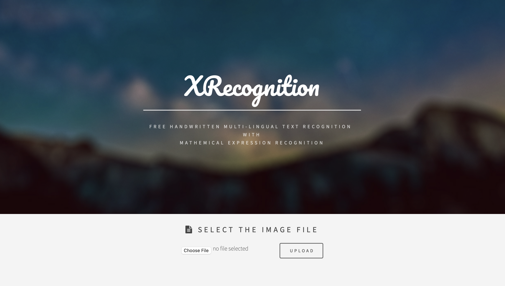

<h1>
This is XRecognition 
 </h1>

<h3> XRecognition is a Multi-Lingual Handwritten Text Recognizer with Mathematical Experssion Recognition. </h3>

This is a web application made on FLASK Framework of Python and sqlite3 Database. For Front-end HTML,CSS, JavaScript is used.
The main program of the application is "application.py" which starts the program.
The web application asks user to upload any handwriiten scanned images (JPEG,PNG..etc)
and then it scans the text and expressions from the image and write it into a text file "output.txt" which then can be downloaded by the user.
To Recognise the text (OCR) - I have use VISION API from GCP (Google Cloud Vision API)

<h4>
Here is the modules/Libraries needed for this project.
</h4>

   Package                  Version
 -----------------------  ----------
- cachetools               4.1.0
- certifi                  2020.4.5.1
- chardet                  3.0.4
- click                    7.1.1
- cs50                     5.0.3
- Flask                    1.1.2
- Flask-Session            0.3.1
- google-api-core          1.17.0
- google-auth              1.14.0
- google-cloud-vision      1.0.0
- googleapis-common-protos 1.51.0
- grpcio                   1.28.1
- idna                     2.9
- itsdangerous             1.1.0
- Jinja2                   2.11.2
MarkupSafe               1.1.1
numpy                    1.18.3
panda                    0.3.1
pip                      20.0.2
protobuf                 3.11.3
pyasn1                   0.4.8
pyasn1-modules           0.2.8
pytz                     2019.3
requests                 2.23.0
rsa                      4.0
setuptools               46.1.3
six                      1.14.0
SQLAlchemy               1.3.16
sqlparse                 0.3.1
termcolor                1.1.0
urllib3                  1.25.9
Werkzeug                 0.16.0
wheel                    0.34.2

Here is a Video Demonstrating how this application works!

